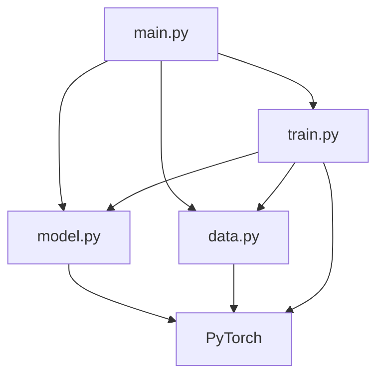
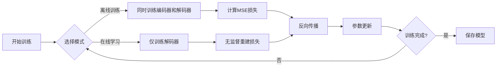

# CsiNet-Pytorch 架构图

## 项目结构概览

```
CsiNet-Pytorch/
├── main.py          # 程序入口点
├── model.py         # 神经网络模型定义
├── data.py          # 数据处理和加载
├── train.py         # 训练逻辑实现
└── README.md        # 项目说明文档
```

## 数据流向图

```
原始CSI数据(csv) → data.py → DataLoader → train.py → model.py
     ↓                                                    ↓
   预处理                                                 训练
     ↓                                                    ↓
   归一化                                              参数更新
     ↓                                                    ↓
   批量加载                                          模型保存
```

## 模块依赖关系



## 训练流程图



## 网络架构详情

### Encoder (编码器)
```
Input: 512-dim CSI (real part)
    ↓
Linear(512→256) + ReLU
    ↓
Linear(256→128) + ReLU  
    ↓
Linear(128→64) 
    ↓
Output: 64-dim codeword
```

### Decoder (解码器)
```
Input: 64-dim codeword
    ↓
Linear(64→128) + ReLU
    ↓
Linear(128→256) + ReLU
    ↓
Linear(256→512)
    ↓
Output: 512-dim reconstructed CSI
```

## 关键技术特点

1. **分离式架构**：编码器固定，解码器可更新
2. **双模式训练**：支持监督学习和无监督在线学习
3. **物理约束**：集成功率约束正则化
4. **GPU加速**：自动检测并利用CUDA
5. **实际场景适配**：模拟真实通信系统限制

## 评估指标体系

- **NMSE**：归一化均方误差（主要指标）
- **训练时间**：计算效率评估
- **收敛性**：训练稳定性分析
- **泛化能力**：不同场景适应性